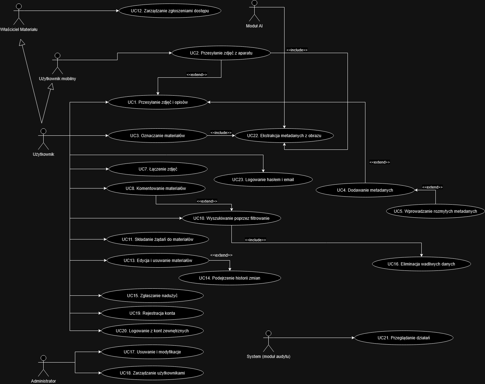
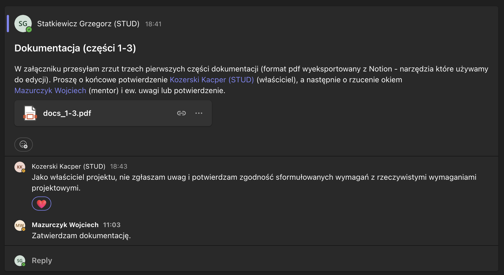

# Local Archive

# Wprowadzenie

## Temat

### Local community archive system with metadata-based sharing on request

- Community archives empower local residents and history enthusiasts through
collecting and sharing pictures, videos, or stories about the local area's history
and evolution. Additionally, the contents of such systems are interesting from
the point of view of historical research.
- We want to create a digital archive and a web and/or mobile app that would
encourage more people to store their pictures or other data in a place easily
accessible for researchers and other interested people. The data structure
should not only be multimodal but also encompass all of the relationships
between the data e.g., a story is about a picture, or a series of photos taken
together.
- The most valuable historical materials are often in the private records of the
elderly, which calls for a simple and intuitive UI.
- Since such data can be sensitive, users should be able to choose whether the
uploaded file is private or public.
- If someone wants to discover how a place has changed over time, they should
be able to query the data based on geographical localization and period. If
some data is private, a request could be sent, specifying what the data will be
used for.

### Evaluation criteria

- GUI should be simple and intuitive
- the data has to be stored safely and privately
- the system has to enable effective querying the data based on specified
metadata
- the on-request sharing of the files should be present – but the requesting
process shouldn’t disclose the identitity of the data owners

### Data

- Can be found on Facebook groups, old photo books, etc.
The data should be stored in a persisent and private manner

### Technologies

- It is encouraged to use open-source technologies

### Resources

- [https://cas.org.pl/centre-of-community-archives/](https://cas.org.pl/centre-of-community-archives/)
- [https://www.facebook.com/groups/starawarszawanafotografiach](https://www.facebook.com/groups/starawarszawanafotografiach)
- [https://www.facebook.com/DawnyZakrzowek](https://www.facebook.com/DawnyZakrzowek)

## Cel projektu

Głównym celem projektu jest zebranie, bezpieczne przechowywanie i udostępnienie cennych materiałów, takich jak zdjęcia oraz opisy, które dokumentują rozwój i zmiany lokalnego otoczenia. Realizacja tego celu ma niebagatelne znaczenie zarówno dla mieszkańców, jak i historyków oraz badaczy, którzy potrzebują rzetelnych źródeł informacji do prowadzenia analiz i badań naukowych. Dodatkowo, projekt odpowiada na potrzebę ochrony prywatności, umożliwiając użytkownikom oznaczanie przesyłanych materiałów jako publiczne lub prywatne oraz wdrożenie mechanizmu udostępniania na żądanie, który zachowuje anonimowość właściciela danych.

## Wstępna wizja projektu

Rozwiązanie składać się będzie z:

1. interfejsu użytkownika
    1. aplikacja web’owa - obejmuje wszystkie funkcjonalności systemowe
    2. aplikacja mobilna - umożliwia podstawowe zarządzanie materiałami (tworzenie zdjęć oraz ich opisywanie, udzielanie dostępu etc.)
2. api - obejmujące całą logikę systemową 
3. warstwy bazy danych
    1. relacyjna baza danych - będąca głównym źródłem danych w systemie
    2. indeks - umożliwiający łatwe wyszukiwanie po metadanych
    3. storage - umożliwiający przechowywanie zdjęć

Wyróżnieni użytkownicy systemu:

1. Przeglądający (Viewer)
    - Ma dostęp do przeglądania publicznych materiałów oraz wyników wyszukiwania
    - Może składać żądania dostępu do materiałów prywatnych, jednak nie posiada uprawnień edytorskich
2. Twórca (Contributor)
    - Może przesyłać zdjęcia i opisy tekstowe.
    - Odpowiada za dodawanie metadanych do materiałów oraz ich oznaczanie jako publiczne lub prywatne.
    - Ma możliwość edycji i usuwania własnych materiałów
3. Administrator (Admin)
    - Zarządza treściami w systemie, w tym moderacją, usuwaniem wadliwych materiałów oraz modyfikacją metadanych w przypadku naruszeń
    - Posiada uprawnienia do zarządzania użytkownikami (np. wyciszanie, blokowanie kont)
    - Odpowiada za konfigurację systemu, monitorowanie działań użytkowników oraz przeprowadzanie audytu bezpieczeństwa

Przewidywane technologie:

1. interfejs użytkownika
    1. aplikacja web’owa - js, angular, 
        1. mapy - [https://www.mapbox.com/](https://www.mapbox.com/pricing#maps)??
    2. aplikacja mobilna - dart, flutter
2. api - python, fastapi
3. warstwy bazy danych
    1. relacyjna baza danych - postgresql
    2. indeks - elastic search
    3. storage - blob storage (np. Google Cloud Storage)

# Metodologia wytwarzania

## Komunikacja

Komunikacja wewnątrz zespołu odbywa się za pomocą komunikatorów Discord oraz Messenger. Komunikacja z właścicielem tematu odbywa się za pomocą komunikatora Discord. Komunikacja z mentorem odbywa się za pomocą platformy Teams.

## Spotkania

Przewidywana częstotliwość spotkań to 1 - 2 spotkania tygodniowo. Spotkania odbywają się zdalnie, na platformie Discord. W szczególnych przypadkach przewidujemy spotkania na miejscu.

## Podział ról

Rolę Team Leader’a oraz odpowiedzialnego za komunikację przejmuje Grzegorz Statkiewicz.

### Obszary odpowiedzialności

Zespół będzie podzielony na poszczególne obszary:

1. Jakub - interfejs użytkownika
2. Bartłomiej - api, interfejs użytkownika
3. Karol - api, warstwy bazy danych
4. Grzegorz - api, warstwy bazy danych

## Kwestie sporne

Zagadnienia, w których będzie występowała różnica zdań między członkami zespołu, a które nie będą mogły zostać rozwiązane za pomocą demokratycznego głosowania przeprowadzonego w grupie, planujemy rozwiązywać poprzez merytoryczną dyskusję. Jeżeli i ten środek zawiedzie decydujące zdanie powierzone będzie Grzegorzowi Statkiewiczowi, ze względu na największe doświadczenie zawodowe w zespole oraz jednogłośną decyzję członków o mianowaniu ww. Team Leaderem grupy.

## Analiza ról w zespole

Wyniki testu Belbina dla poszczególnych członków zespołu

| Rola / Członek | Grzegorz | Kuba | Bartek | Karol |
| --- | --- | --- | --- | --- |
| Shaper | x |  | x | x |
| Coordinator |  |  |  |  |
| Implementer |  |  | x |  |
| Plant | x | x |  |  |
| Resource
Investigator |  | x |  |  |
| Evaluator |  |  | x |  |
| Team Worker |  | x |  | x |
| Completer
Finisher |  |  |  | x |
| Specialist | x |  |  |  |

# Wymagania projektowe

## Wymagania biznesowe i użytkownika

### Wymagania biznesowe

1. Historycy potrzebują dostępu do wysokiej jakości materiałów wizualnych, aby prowadzić rzetelne badania nad dziedzictwem kulturowym.
2. Społeczność lokalna potrzebuje możliwości aktywnego uczestnictwa w dokumentowaniu i udostępnianiu treści wizualnych, aby wzmacniać swoją tożsamość i dziedzictwo kulturowe.
3. Historycy i badacze potrzebują zapewnienia transparentnego i kontrolowanego zarządzania materiałami wizualnymi, aby mieć gwarancję ich autentyczności i wiarygodności przy prowadzeniu badań naukowych.

### Wymagania użytkownika

1. Użytkownik powinien mieć możliwość przesyłania wcześniej zapisanych zdjęć i opisów tekstowych.
2. Użytkownik powinien mieć możliwość tworzenia zdjęć (np. poprzez aparat w telefonie) i ich przesyłania wraz z opisem tekstowym.
3. Użytkownik powinien móc oznaczyć swoje materiały jako publiczne lub prywatne, gdzie zadeklaruje ich posiadanie ale nie przesyła ich zawartości bezpośrednio do systemu (nie dokonuje wgrania materiałów).
4. Użytkownik powinien mieć możliwość opisywania swoich materiałów za pomocą metadanych, których typ jest z góry określony - predefiniowany (lokalizacja, zakres dat utworzenia zdjęcia, zawartość zdjęcia - opis tekstowy, dokładny adres) oraz własny.
5. Użytkownik powinien mieć możliwość opisywania danych w postaci “rozmytych” metadanych (podać przedziały niepewności jeśli nie ma dokładnej wiedzy). Każda “predefiniowana” metadana powinna wspierać wartości “rozmyte”, czyli takie, które nie wskazują jednoznacznie na konkretną wartość zadanej metadanej:
    1. lokalizacja - możliwość wprowadzenia częściowego adresu (np. ulica, miasto, powiat itp.) lub obszaru (punkt, promień)
    2. zakres dat utworzenia zdjęcia - “od do”, data początkowa, data końcowa oraz dalej - dekady, stulecia itp.
    3. zawartość zdjęcia - wybór nazw obiektów z listy (możliwych wiele wartości), wpisanie wartości własnej
    4. inne - potraktowane jako wartość tekstowa
6. Użytkownik powinien mieć możliwość przesłania lub stworzenia większej ilości zdjęć zawierających ten sam opis, wskazujących na ten sam obiekt.
7. Użytkownik powinien mieć możliwość komentowania innych zdjęć załączonych przez społeczność, a także reagowania na nie (w formie polubień / niepolubień)
8. Użytkownik powinien móc przeglądać dostępne materiały na podstawie geolokalizacji, zawartości (fraza szukana, dokładny adres) i przedziału czasowego.
9. Użytkownik powinien mieć możliwość wyszukiwania treści bezpośrednio na podstawie predefiniowanych metadanych oraz pośrednio, przez szukaną frazę, na podstawie własnych metadanych.
10. Użytkownik powinien móc zgłaszać prośbę o dostęp do prywatnych materiałów, podając uzasadnienie.
11. Użytkownik powinien móc zobaczyć prośby o dostęp do zadeklarowanych prywatnych materiałów, mając na uwadze potencjalny napływ zapytań.
12. Użytkownik powinien mieć możliwość zaakceptowania lub odrzucenia prośby o dostęp do zadeklarowanych prywatnych materiałów.
13. Użytkownik powinien mieć możliwość edytowania i usuwania swoich materiałów.
14. Użytkownik powinien mieć możliwość zgłaszania nadużyć lub błędnych danych w archiwum za pomocą uwag, oraz zaproponować poprawną treść.
15. Użytkownik powinien mieć możliwość potwierdzenia zgłaszanej uwagi głosując na nią.
16. Użytkownik powinien mieć możliwość niezakłóconego wyszukiwania przez wadliwe dane.
17. Użytkownik administrator powinien mieć możliwość usunięcia wadliwej treści (zdjęcia).
18. Użytkownik administrator powinien mieć możliwość zmiany charakterystyki przesłanego zdjęcia (czyli zmiany wartości metadanych oraz opisu) jeśli zostaną wykryte naruszenia.
19. Użytkownik administrator powinien mieć możliwość wyciszenia (brak możliwości interakcji z systemem - dodawania materiałów, reakcji etc.) oraz zablokowania (całkowity brak dostępu do systemu) użytkownika publikującego wadliwe treści jeśli zajdzie taka konieczność.

## Wymagania systemowe

### Wymagania funkcjonalne

1. System umożliwi przesyłanie zapisanych zdjęć i opisów tekstowych oraz ich bezpieczne przechowywanie, zapewniając integralność przesyłanych danych 
2. System umożliwi korzystanie z aparatu do tworzenia zdjęć i natychmiastowego przesyłania ich wraz z opisem tekstowym
3. System umożliwi oznaczania materiałów jako publiczne lub prywatne, umożliwiający deklarację posiadania treści bez fizycznego przesyłania plików w przypadku materiałów prywatnych
4. System umożliwi dodawanie metadanych do materiałów za pomocą predefiniowanych typów metadanych (lokalizacja, zakres dat, opis, dokładny adres) oraz dodatkowych, niestandardowych metadanych definiowanych przez użytkownika
5. System umożliwi wprowadzanie “rozmytych” wartości metadanych poprzez definiowanie przedziałów niepewności dla predefiniowanych pól lub wartości cząstkowych
    1. lokalizacja - możliwość wprowadzenia częściowego adresu (np. ulica, miasto, powiat itp.) lub obszaru (punkt, promień)
    2. zakres dat utworzenia zdjęcia - “od do”, data początkowa, data końcowa oraz dalej - dekady, stulecia itp.
    3. zawartość zdjęcia - wybór nazw obiektów z listy (możliwych wiele wartości), wpisanie wartości własnej
    4. inne - potraktowane jako wartość tekstowa
6. System umożliwi wpisanie/zaznaczanie wartości przedziałów w celu wyszukania po “rozmytych” wartości metadanych
    1. lokalizacja - możliwość wyszukania po częściowym adresie (np. ulica, miasto, powiat itp.) lub obszarze (punkt, promień)
    2. zakres dat utworzenia zdjęcia - “od do”, data początkowa, data końcowa oraz dalej - dekady, stulecia itp.
    3. zawartość zdjęcia - wybór nazw obiektów z listy (możliwych wiele wartości) lub wyszukanie podciągu w wartości
    4. inne - potraktowane jako wartość tekstowa, wyszukanie podciągu w wartości
7. System umożliwi łączenie wielu zdjęć przypisanych do jednego opisu lub obiektu, wspierając agregację materiałów wizualnych
8. System umożliwi komentowanie zdjęć oraz dodawanie reakcji w postaci polubień i niepolubień, zapewniając spójność i moderację treści przez społeczność 
9. System umożliwi przeglądanie materiałów na podstawie kryteriów wobec z góry skategoryzowanych metadanych takich jak geolokalizacja, fraza wyszukiwania, dokładny adres oraz przedział czasowy, wykorzystując zaawansowane algorytmy indeksowania
10. System umożliwi wyszukiwanie treści zarówno przez filtrowanie predefiniowanych metadanych, jak i przez analizę niestandardowych metadanych wprowadzanych przez użytkownika, wraz z wyświetleniem wyników przy odpowiednim ich pozycjonowaniu względem relewantności
11. System umożliwi składanie żądań dostępu do prywatnych materiałów poprzez interfejs, w którym użytkownik może dołączyć uzasadnienie, a zgłoszenia będą zapisywane w bazie danych. Takie żądanie powinno być również możliwe z poziomu listy wyszukanych materiałów.
12. System umożliwi zarządzanie zgłoszeniami dostępu do prywatnych materiałów, umożliwiając ich przegląd oraz akceptację lub odrzucenie przez właściciela materiału, dbając o jego prywatność
13. System umożliwi użytkownikom edycję i usuwanie własnych materiałów
14. System umożliwi użytkownikom podejrzenie historii zmian w swoich treściach, w których będą mogli zobaczyć momenty i ich treści
15. System umożliwi zgłaszanie nadużyć lub błędnych danych z możliwością dodania uwag oraz propozycji korekty, a także głosowania na te zgłoszenia
16. System umożliwi filtrację wyników wyszukiwania, eliminując lub oznaczając wyniki zawierające wadliwe lub niezweryfikowane dane
17. System umożliwi administratorom usuwanie materiałów uznanych za wadliwe oraz modyfikację wartości ich metadanych i opisów w przypadku wykrycia naruszeń
18. System umożliwi zarządzanie użytkownikami, umożliwiając administratorom wyciszanie (brak możliwości interakcji z systemem - dodawania materiałów, reakcji etc.) lub blokowanie kont (całkowity brak dostępu do systemu) użytkowników publikujących treści naruszające regulamin
19. System umożliwi mechanizm autoryzacji i uwierzytelniania oparty o role (przeglądający, twórca, administrator), zapewniając bezpieczny dostęp do funkcjonalności systemu oraz prywatnych materiałów
20. System umożliwi rejestrację kont w oparciu o email oraz hasło, które następnie wymagać będzie potwierdzenia poprzez skrzynkę mailową, oraz późniejsze logowanie z ich wykorzystaniem
21. System umożliwi logowanie z użyciem kont zewnętrznych dostawców - konto Google
22. System umożliwi rejestrowanie wszystkich działań użytkowników i administratorów (np. przesyłanie, edycję, usuwanie treści oraz operacje związane z dostępem do materiałów) w celu umożliwienia audytu i monitorowania bezpieczeństwa
23. System umożliwi automatyczną ekstrakcję podstawowych metadanych z przesyłanych obrazów wykorzystując metody sztucznej inteligencji, co usprawni przeglądanie oraz wyszukiwanie treści
24. System umożliwi użytkownikom głosowanie na zgłoszone uwagi dotyczące nadużyć lub błędnych danych

### Wymagania niefunkcjonalne

1. System umożliwi równoległe przeglądanie zawartości przez przynajmniej 100 użytkowników w danym momencie, gwarantując przetwarzanie zapytań o średniej złożoności do 5 sekund (95 percentyl)
2. System umożliwi korzystanie z responsywnego i intuicyjnego interfejsu użytkownika, gwarantujący płynne działanie na różnych urządzeniach (desktop, mobile) i przeglądarkach
3. System zapewni integralność przesyłanych danych
4.  System powinien zapewniać szyfrowanie przesyłanych i przechowywanych danych, aby chronić prywatność użytkowników oraz integralność materiałów
5. System powinien gwarantować, że wyszukiwanie wyników będzie niezależne od błędnych lub wadliwych danych, co zapewni spójność i wysoką jakość prezentowanych wyników

## Przypadki użycia

- UC1: Przesyłanie zapisanych zdjęć i opisów tekstowych
    - Aktorzy: użytkownik
    - Scenariusz:
        1. Użytkownik wybiera opcję „Prześlij zdjęcie” w interfejsie
        2. Użytkownik wybiera zdjęcia i dodaje opis tekstowy wraz z odpowiednimi metadanymi
        3. Użytkownik weryfikuje poprawność wprowadzonych danych i potwierdza ich przesłanie
        4. System przesyła plik do warstwy storage, zapisuje metadane w bazie, zapewnia integralność danych oraz dokonuje wstępnej weryfikacji przesłanych informacji
    - Warunki końcowe:
        - Zdjęcie oraz opis tekstowy wraz z metadanymi są zapisywane w bazie
        - Operacja jest zapisywana w bazie w postaci logu
    - Include: UC22
    - Scenariusze alternatywne:
        
        **1a.** Użytkownik anuluje przesyłanie przed potwierdzeniem:
        
        → System anuluje operację, nic nie zostaje zapisane. → **koniec**
        
        **2a.** Użytkownik nie dodaje wymaganych metadanych:
        
        → System wyświetla komunikat o brakujących danych i nie pozwala przejść dalej → **goto 2**
        
        **4a.** Występuje błąd przy przesyłaniu pliku (np. utrata połączenia):
        
        → System informuje użytkownika o błędzie i umożliwia ponowne przesłanie. → goto3
        
- UC2: Przesyłanie zdjęć z aparatu (tryb mobilny)
    - Aktorzy: użytkownik mobilny
    - Scenariusz:
        1. Użytkownik otwiera aplikację mobilną i wybiera funkcję „Zrób zdjęcie”
        2. Aplikacja uruchamia aparat, umożliwiając wykonanie zdjęcia
        3. Użytkownik zatwierdza zdjęcie i dodaje opis wraz z metadanymi
        4. System przesyła zdjęcie i opis do serwera
    - Warunki końcowe:
        - Zdjęcie oraz opis tekstowy wraz z metadanymi są zapisywane w bazie
        - Operacja jest zapisywana w bazie w postaci logu
    - Include: UC22
    - Extend: UC1
    - Scenariusz alternatywny
        
        **3a.** Użytkownik odrzuca zdjęcie → Aplikacja wraca do trybu aparatu i pozwala zrobić nowe zdjęcie. → goto 2
        
- UC3: Oznaczanie materiałów jako publiczne lub prywatne
    - Aktorzy: użytkownik
    - Scenariusz:
        1. Podczas tworzenia materiału użytkownik wybiera opcję oznaczenia materiału jako publiczny lub prywatny
        2. System zapisuje wybrany status wraz z metadanymi, umożliwiając późniejszy dostęp zgodnie z ustawieniami prywatności
    - Warunki końcowe:
        - Operacja jest zapisywana w bazie w postaci logu
- UC4: Dodawanie predefiniowanych i niestandardowych metadanych
    - Aktorzy: użytkownik
    - Scenariusz:
        1. Użytkownik przesyła materiał  i zostaje poproszony o dodanie metadanych
        2. System prezentuje listę predefiniowanych pól (lokalizacja, zakres dat, opis, adres) oraz umożliwia dodanie własnych wartości
        3. Użytkownik uzupełnia wymagane pola i potwierdza zapis
        4. System zapisuje cały pakiet danych (zdjęcie, opis i metadane) w ramach jednej transakcji do bazy danych.
    - Warunki końcowe:
        - Operacja jest zapisywana w bazie w postaci logu
    - Extends: U1, U2
    - Scenariusze alternatywne:
        
        **2a.** Użytkownik nie wprowadza wartości do wymaganych pól → System wyświetla komunikat o brakach i nie pozwala przejść dalej → **goto 2**
        
- UC5: Wprowadzanie rozmytych wartości metadanych
    - Aktorzy: użytkownik
    - Scenariusz:
        1. Użytkownik podczas dodawania metadanych wybiera opcję wprowadzenia „rozmytych” wartości (np. część adresu, przybliżony przedział dat)
        2. System umożliwia określenie niepewności (np. promień geograficzny, zakres dat)
        3. Użytkownik zatwierdza wprowadzone wartości
        4. System zapisuje rozmyte metadane z informacją o przedziałach niepewności
    - Extend: UC4
- UC7: Łączenie wielu zdjęć do jednego opisu/obiektu
    - Aktorzy: użytkownik
    - Scenariusz:
        1. Użytkownik tworzy nowy opis/obiekt w systemie
        2. Użytkownik dodaje wiele zdjęć, które mają być przypisane do tego samego opisu
        3. System łączy przesłane zdjęcia z jednym obiektem i zapisuje tę związek w bazie danych
        4. Użytkownik otrzymuje potwierdzenie poprawnego powiązania materiałów
- UC8: Komentowanie materiałów i dodawanie reakcji
    - Aktorzy: użytkownik
    - Scenariusz:
        1. Użytkownik wybiera przesłany materiał (np. zdjęcie) w interfejsie
        2. Użytkownik wpisuje komentarz lub wybiera reakcję (polubienie/niepolubienie)
        3. System zapisuje komentarz lub reakcję oraz aktualizuje licznik interakcji
        4. Komentarze i reakcje są widoczne dla pozostałych użytkowników
    - Warunki końcowe:
        - Operacja jest zapisywana w bazie w postaci logu
    - Extend: U10
    - Scenariusze alternatywne:
        
        **2a.** Użytkownik próbuje dodać pusty komentarz → System nie pozwala zatwierdzić pustego pola. → **goto 2**
        
- UC10: Wyszukiwanie treści poprzez filtrowanie metadanych i analizę niestandardowych pól
    - Aktorzy: użytkownik
    - Scenariusz:
        1. Użytkownik przechodzi do zaawansowanego wyszukiwania
        2. Użytkownik wybiera predefiniowane metadane (w tym wartości “rozmyte” takie jak: częściowy adres, przybliżony zakres dat, fragment opisu) oraz ewentualnie wpisuje niestandardowe kryteria wyszukiwania
        3. System wykonuje zapytanie do bazy i indeksu, analizując zarówno metadane, jak i treść niestandardową
        4. Wyniki są prezentowane, uporządkowane według relewantności
    - Include: UC16
    - **Scenariusze alternatywne:**
    
    **2a.** Użytkownik nie wprowadza żadnych kryteriów: → System wyświetla komunikat o konieczności podania przynajmniej jednego filtra. → **goto 2**
    
- UC11: Składanie żądania dostępu do prywatnych materiałów
    - Aktorzy: użytkownik
    - Scenariusz:
        1. Użytkownik przeglądając materiały napotyka zasoby oznaczone jako prywatne
        2. Użytkownik wybiera opcję „Poproś o dostęp” i wprowadza uzasadnienie
        3. System zapisuje zgłoszenie w bazie danych, bez ujawniania tożsamości właściciela materiału
        4. Powiadomienie trafia do właściciela prywatnych materiałów
    - Extend: UC9 gdy próbie dostępu do materiału prywantego
    - Warunki końcowe:
        - Operacja jest zapisywana w bazie w postaci logu
- UC12: Zarządzanie zgłoszeniami dostępu do prywatnych materiałów
    - Aktorzy: właściciel materiału
    - Warunki wstępne:
        - Użytkownik jest zalogowany
        - Użytkownik jest właścicielem materiału
    - Scenariusz:
        1. Właściciel przechodzi do sekcji zgłoszeń
        2. System prezentuje listę otrzymanych żądań wraz z uzasadnieniami
        3. Właściciel wybiera zgłoszenie i decyduje o jego akceptacji lub odrzuceniu
        4. System informuje wnioskodawcę o decyzji, zachowując anonimowość właściciela
- UC13: Edycja i usuwanie własnych materiałów
    - Aktorzy: użytkownik
    - Warunki wstępne:
        - Użytkownik jest zalogowany
        - Użytkownik jest właścicielem materiału
    - Scenariusz:
        1. Użytkownik przechodzi do swojego profilu
        2. Użytkownik wybiera konkretny materiał, który chce edytować lub usunąć
        3. System umożliwia dokonanie edycji metadanych/opisu lub usunięcie materiału
        4. Po zatwierdzeniu zmiany, system zapisuje nową wersję lub usuwa materiał
    - Warunki końcowe:
        - Operacja jest zapisywana w bazie w postaci logu
- UC14: Podejrzenie historii zmian materiałów
    - Aktorzy: użytkownik
    - Scenariusz:
        1. Użytkownik wybiera materiał, dla którego chce zobaczyć historię zmian
        2. System wyświetla listę zmian z datami i opisem modyfikacji
        3. Użytkownik może przeglądać szczegóły poszczególnych wersji
        4. System zapewnia możliwość powrotu do poprzedniej wersji, jeśli to konieczne
    - Extend: UC13, UC9
- UC15: Zgłaszanie nadużyć lub błędnych danych
    - Aktorzy: użytkownik
    - Scenariusz:
        1. Użytkownik przegląda materiały i zauważa wadliwe lub błędne dane
        2. Użytkownik wybiera opcję „Zgłoś nadużycie/błąd” i dodaje komentarz z propozycją korekty
        3. System zapisuje zgłoszenie oraz umożliwia głosowanie na już zgłoszone błędy
    - Extend: UC9
    - Warunki końcowe:
        - Operacja jest zapisywana w bazie w postaci logu
- UC16: Filtracja wyników wyszukiwania (eliminacja wadliwych danych)
    - Aktorzy: użytkownik
    - Scenariusz:
        1. Użytkownik wykonuje zapytanie wyszukiwania
        2. System analizuje wyniki, identyfikując materiały oznaczone jako wadliwe lub niezweryfikowane
        3. System filtruje lub oznacza takie wyniki, aby nie zakłócały przeglądania treści
        4. Użytkownik otrzymuje przefiltrowaną listę wyników
- UC17: Usuwanie i modyfikacja treści przez administratora
    - Aktorzy: administrator
    - Warunki wstępne:
        - Użytkownik jest zalogowany
        - Użytkownik posiada uprawnienia administratora
    - Scenariusz:
        1. Administrator przechodzi do panelu zarządzania treścią
        2. System prezentuje listę zgłoszonych wadliwych materiałów
        3. Administrator wybiera materiał do usunięcia lub modyfikacji metadanych/opisu
        4. System dokonuje odpowiedniej operacji i aktualizuje stan danych w bazie
    - Warunki końcowe:
        - Treści zostają zmodyfikowane oraz zapisane w bazie
- UC18: Zarządzanie użytkownikami (wyciszanie i blokowanie)
    - Aktorzy: administrator
        - Użytkownik jest zalogowany
        - Użytkownik posiada uprawnienia administratora
    - Scenariusz:
        1. System prezentuje listę aktywnych użytkowników wraz z historią interakcji
        2. Administrator wybiera użytkownika łamiącego regulamin i decyduje o wyciszeniu lub blokowaniu konta
        3. System wprowadza ograniczenia w dostępie użytkownika, informując go o podjętych działaniach
- UC19: Rejestracja kont przy użyciu email i hasła
    - Aktorzy: użytkownik
    - Scenariusz:
        1. Użytkownik wybiera opcję rejestracji w systemie
        2. Na ekranie rejestracji wyświetlane są pola: adres email, hasło, potwierdzenie hasła oraz przycisk „Zarejestruj się”.
        3. Użytkownik podaje adres email oraz hasło
        4. System wysyła link aktywacyjny na podany adres email
        5. Użytkownik klika link, a system aktywuje konto i umożliwia logowanie
    - Scenariusz alternatywny:
    **3a.** Jeśli użytkownik poda niekompletne lub niepoprawne dane (np. hasło nie spełnia wymagań), system wyświetla komunikat o błędzie i prosi o korektę danych → goto 2
    - Warunki końcowe
        - Użytkownik posiada konto w systemie
        - Operacja jest zapisywana w bazie w postaci logu
- UC20: Logowanie przy użyciu kont zewnętrznych (Google)
    - Aktorzy: użytkownik
    - Scenariusz:
        1. Użytkownik wybiera opcję logowania przez konto Google
        2. System przekierowuje użytkownika do autoryzacji za pośrednictwem Google
        3. Po pozytywnej weryfikacji, system tworzy lub aktualizuje profil użytkownika
    - Warunki końcowe:
        - Użytkownik posiada konto w systemie
        - Operacja jest zapisywana w bazie w postaci logu w postaci logu
- UC21: Przeglądanie działań użytkowników i administratorów
    - Aktorzy: system (moduł audytu)
    - Scenariusz:
        1. Administrator wybiera opcję podglądu zdarzeń
        2. Administrator może przeglądać zapisane operacje
        3. System umożliwia generowanie raportów z działań na żądanie
- UC22: Automatyczna ekstrakcja metadanych z przesyłanych obrazów
    - Aktorzy: moduł AI
    - Scenariusz:
        1. Użytkownik przesyła zdjęcie do systemu
        2. System automatycznie analizuje obraz przy użyciu metod sztucznej inteligencji
        3. System wyodrębnia podstawowe metadane (np. data wykonania, geolokalizacja, rozpoznane obiekty)
        4. Ekstrahowane metadane są prezentowane użytkownikowi do ewentualnej edycji i zapisywane w bazie danych
- UC23: Logowanie przy użyciu email i hasła
    - Aktorzy: użytkownik
    - Scenariusz:
        1. Użytkownik wprowadza adres email oraz hasło
        2. System weryfikuje dane i loguje użytkownika, umożliwiając dostęp do konta
    - Scenariusz alternatywny:
    **3a.** Jeśli dane są niepoprawne, system wyświetla komunikat o błędzie i prosi o korektę

## Zatwierdzenie wymagań

